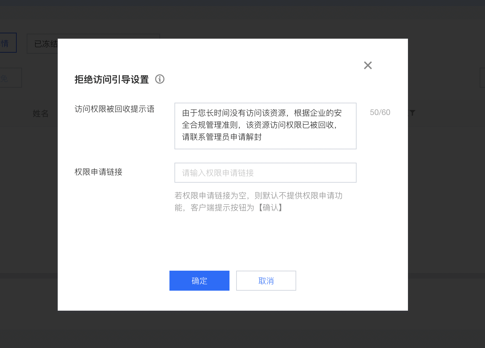
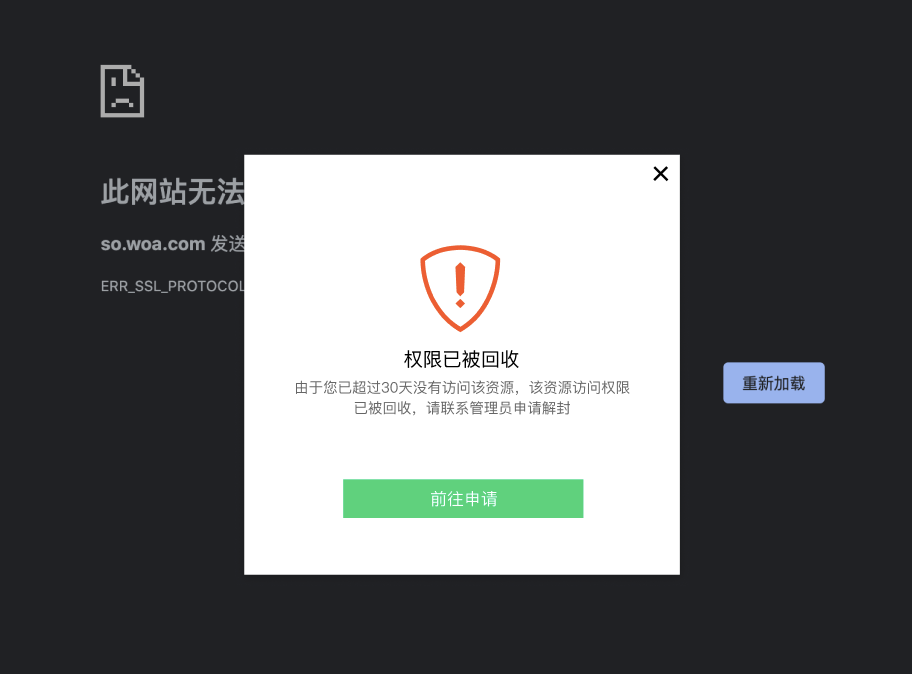

# 权限申请解冻对接

## 控制台配置
位置：用户与授权管理 - 权限收敛 - 僵尸权限详情 - 已冻结 - 拒绝访问引导设置


配置了审批系统的链接之后，客户端如果触发了访问冻结权限的弹窗，按钮会变为前往申请，点击就会拉起系统浏览器加载配置的 URL。



## 后台对接
例如，管理员配置的审批系统链接为：
```
https://example.com/order
```

那么客户端点击按钮，系统里浏览器打开的完整 url 为： 
```
https://example.com.com/order?ioa-info=%7B%22resource_id%22%3A10%2C%22resource_name%22%3A%22%E4%B8%9A%E5%8A%A1%E8%B5%84%E6%BA%90%22%2C%22user_account%22%3A%22test-account%22%2C%22user_id%22%3A102%7D
```

其中，ioa-info 包含的是解冻/豁免接口需要的内容，ioa-info 的值是一个 json，urldecode 之后为：
``` json
{
    "resource_id": 10,
    "resource_name": "业务资源",
    "user_account": "test-account",
    "user_id": 102
}
```

**user_account** 和 **resource_name** 纯展示用途，表示访问的**账号**和访问的**资源名称**

**user_id** 和 **resource_id** 是用户和资源的实际 ID，用于调用控制台的接口，具体接口见 [更新用户权限状态接口](../../开放API/非云规范接口/6.x对外非CAPI规范：更新用户权限状态.md)